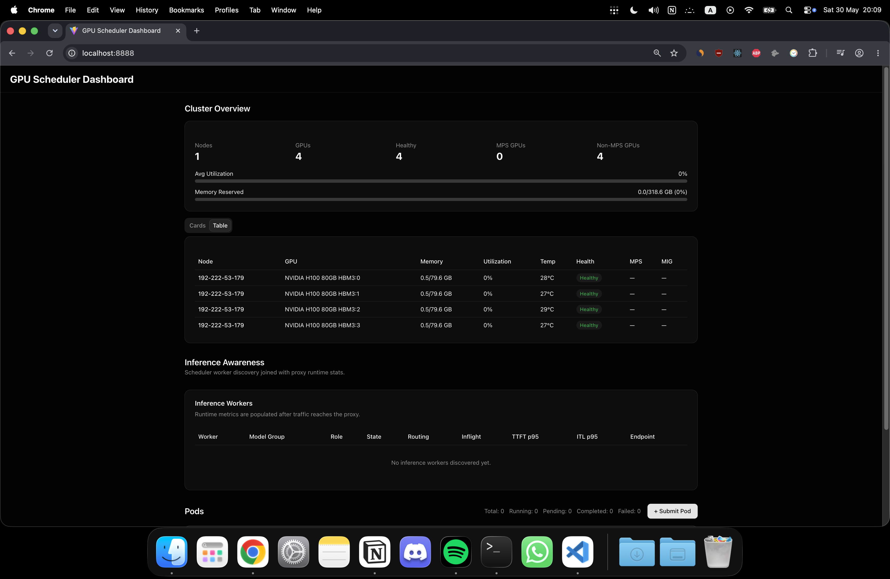
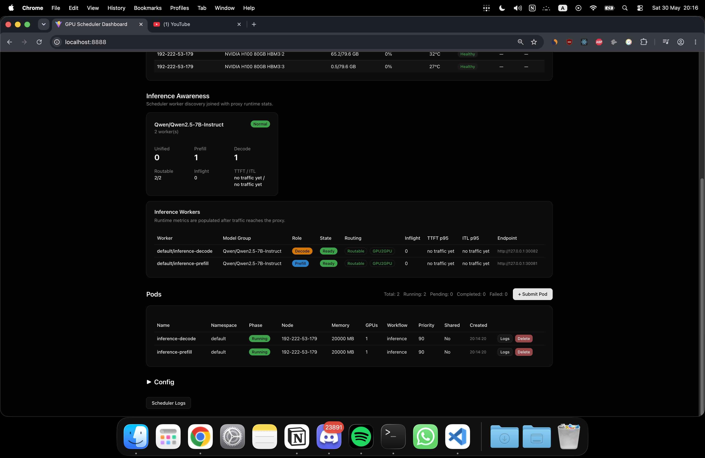
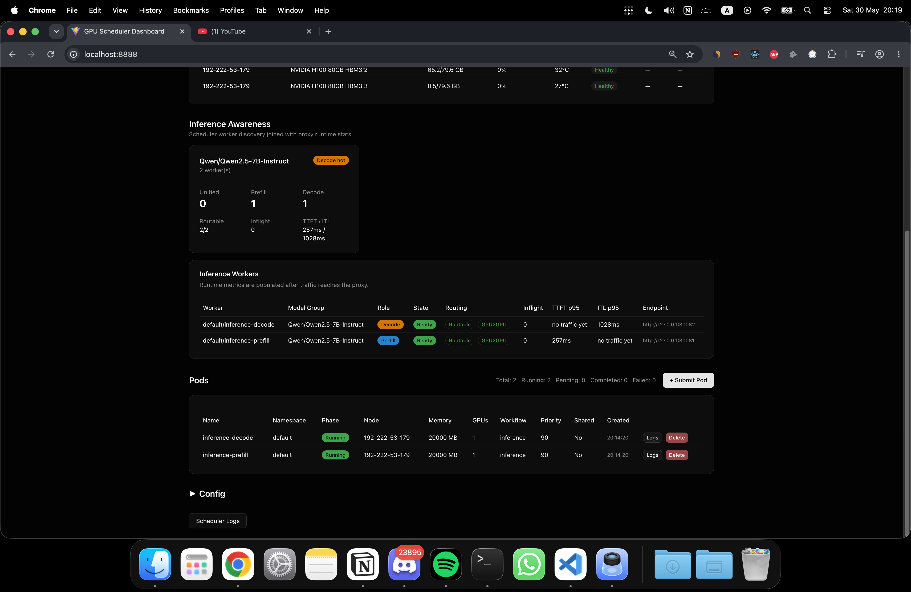
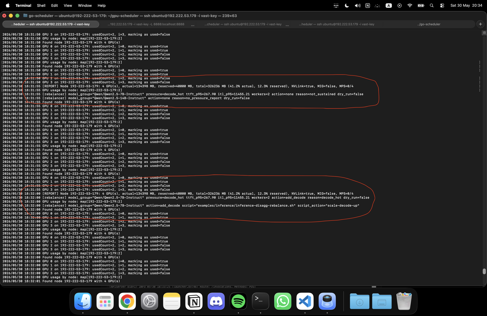
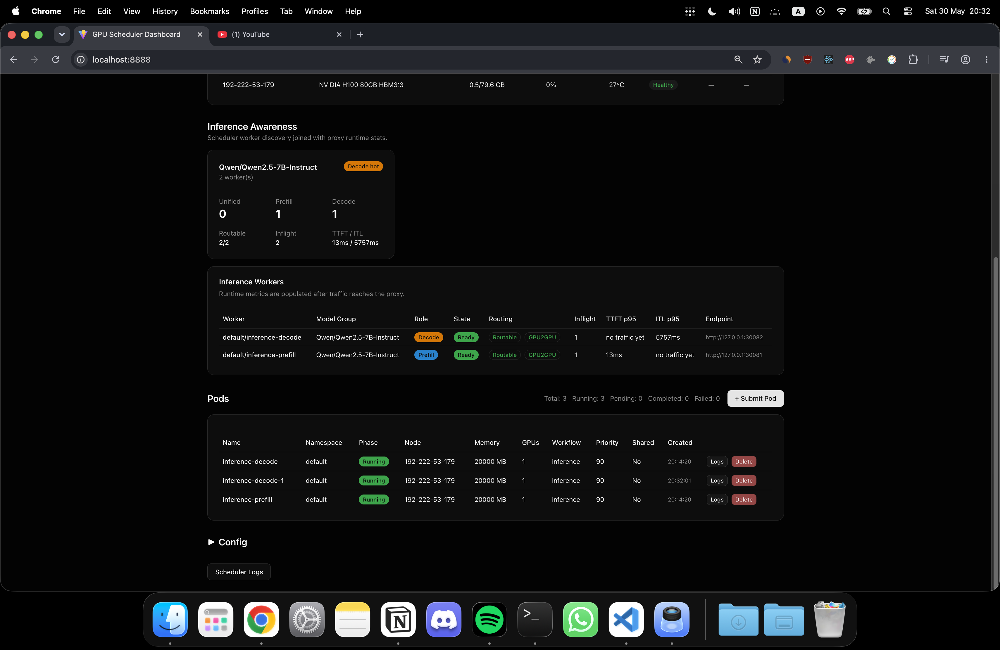
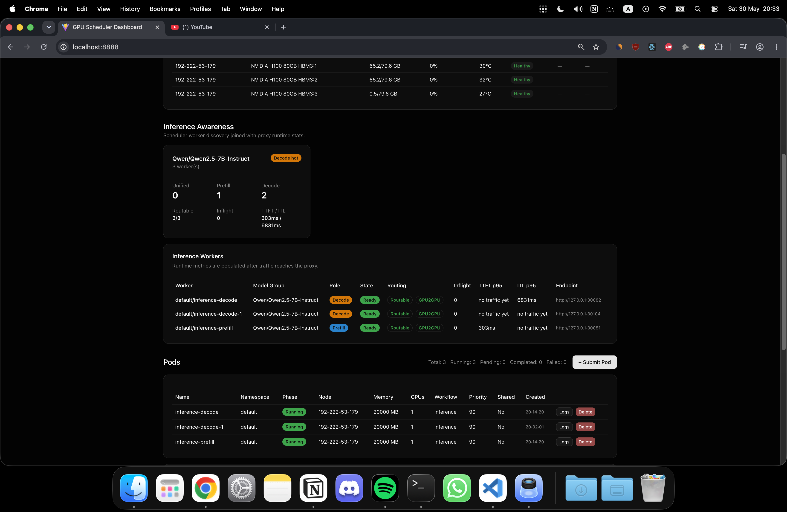
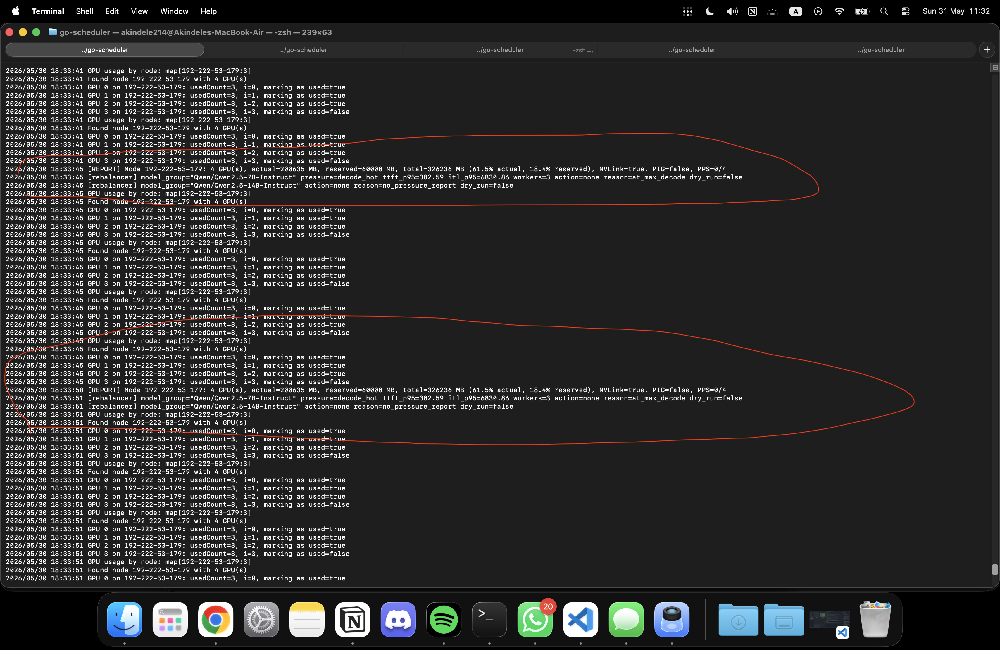

# GPU-Scheduler

[](https://goreportcard.com/report/github.com/akindele214/gpu-scheduler)
[](https://opensource.org/licenses/Apache-2.0)
[](https://golang.org/)
[](https://kubernetes.io/)

## Overview

**GPU-Scheduler** is an open-source, lightweight Kubernetes GPU scheduler for teams sharing GPUs. Drop it into any k3s/kubeadm cluster and get memory-aware scheduling, inference-aware prefill/decode rebalancing, GPU sharing, preemption with checkpoint/auto-resume, and a real-time dashboard — no CRDs, no operator, no vendor lock-in.

It is built for both classic GPU workloads and modern LLM serving. For disaggregated inference, the scheduler understands **prefill**, **decode**, and **unified** workers, watches live pressure signals like TTFT and inter-token latency, and can add the specific worker type that is bottlenecked instead of blindly scaling generic replicas.

### Who Is This For?

- **ML/AI teams (5-20 engineers)** sharing 2-16 GPUs and tired of manual coordination
- **Research labs** that need fair GPU access without the overhead of Slurm or Run:ai
- **Startups** running fine-tuning and inference on-prem or on cloud GPU instances
- **Inference platform teams** experimenting with vLLM disaggregated serving, prefill/decode separation, and phase-aware autoscaling
- Anyone who's hit the limits of the default Kubernetes scheduler with GPU workloads

### What It Does

- **Inference-aware rebalancing**: Detects prefill vs decode pressure and scales the right worker role for vLLM-style disaggregated serving
- **Memory-aware scheduling**: Tracks GPU memory at the MB level, not just GPU count — no more wasted capacity
- **Gang scheduling**: Atomic all-or-nothing placement of distributed training pods (e.g., PyTorch DDP) across multiple nodes
- **Priority preemption with auto-resume**: High-priority jobs checkpoint and evict lower-priority workloads, which are automatically re-queued with boosted priority
- **Shared GPU (MPS)**: Multiple pods share a single GPU with driver-level memory isolation via NVIDIA MPS
- **MIG routing**: Automatically routes jobs to MIG instances or full GPUs based on pod annotations
- **Real-time dashboard**: Web UI with cluster overview, pod submission, GPU utilization, scheduler logs, and pod log streaming
- **Live GPU telemetry**: Per-node GPU agent reports real memory/utilization via NVML every 5 seconds
- **Cross-node support**: Schedule gang jobs across geographically distributed nodes (tested with Tailscale)

### Tested On

- Single-node: 4x RTX 4090 (Vast.ai)
- Disaggregated vLLM inference: A100/H100-class GPUs with NIXL KV transfer
- Multi-node: RTX 3060 + RTX 4060 across Tailscale mesh
- MPS shared GPU: 2 pods on RTX 3060 with EXCLUSIVE_PROCESS mode
- Preemption with auto-resume: checkpoint → evict → re-queue → resume on RTX 3060

## Inference-Aware Scheduling

LLM inference is not one uniform workload. A request usually moves through two phases:

- **Prefill** processes the input prompt and prepares the model's KV cache. This phase is usually compute-heavy and affects time to first token (TTFT).
- **Decode** generates the response token by token. This phase is often memory-bandwidth/KV-cache heavy and affects inter-token latency (ITL) and tokens per second (TPS).

At small scale, a single unified worker can run both phases on the same GPU. At higher scale, one phase can bottleneck the other. Disaggregated inference splits the system into dedicated prefill and decode workers so each phase can scale independently.

GPU-Scheduler makes that split schedulable:

- Tracks inference roles with pod annotations: `prefill`, `decode`, and `unified`
- Groups workers by `model-group`, so multiple models can be managed independently
- Reads pressure reports from the proxy, including TTFT and ITL/TPS signals
- Applies sustain windows and cooldowns to avoid flapping
- Supports dry-run mode before live cluster mutation
- Executes controlled scale-up actions through an execution script
- Deduplicates in-progress pods so it does not create a burst of duplicate workers
- Enforces max prefill/decode worker caps per model group

Example rebalancing flow:

```
Requests → Proxy metrics → Scheduler rebalancer
  → decode_hot detected
  → run scale-decode-up
  → create inference-decode-1
  → scheduler assigns a free GPU
  → worker becomes ready/routable
  → further decode scale-up blocked at max_decode_workers
```

This is different from generic horizontal pod autoscaling. The scheduler is not just asking "do we need more replicas?" It asks "which inference phase is hot, and which GPU worker role should be added?"

### Screenshots

**Dashboard overview**



**Starting point: one prefill worker and one decode worker**



**The scheduler detects decode pressure**



**The rebalancer executes the scale-up action**



**A new decode worker is created and becomes ready**



**After rebalancing: decode capacity has increased**



**Safety cap: the scheduler stops at the configured max decode workers**



## Quick Start

### Prerequisites

- Go 1.23+
- Kubernetes cluster (k3s, kubeadm, EKS, GKE) with NVIDIA GPUs
- NVIDIA Container Toolkit + device plugin installed
- `nvidia.com/gpu` visible in node allocatable resources

### Build

```bash
git clone https://github.com/akindele214/gpu-scheduler.git
cd gpu-scheduler

# Build scheduler
go build -o gpu-scheduler ./cmd/scheduler

# Build GPU agent
go build -o gpu-agent ./cmd/gpu-agent

# Build inference proxy (needed for inference-aware routing/rebalancing)
go build -o proxy ./cmd/proxy
```

### Deploy

```bash
# Apply RBAC (required for pod binding)
kubectl apply -f deploy/rbac.yaml

# Start scheduler on server node
./gpu-scheduler --kubeconfig=/etc/rancher/k3s/k3s.yaml --config=config.yaml &

# Start GPU agent on each GPU node
./gpu-agent --node-name=$(hostname) --scheduler-url=http://localhost:8888 &

# For remote worker nodes, point agent to server IP
./gpu-agent --node-name=$(hostname) --scheduler-url=http://<SERVER_IP>:8888 &
```

### Start Inference Proxy

The inference-aware rebalancer uses the proxy as the control-plane bridge for worker discovery, routing, and pressure reports. Start it after the scheduler is listening on port `8888`:

```bash
GPU_SCHEDULER_PROXY_SCHEDULER_URL=http://localhost:8888 \
GPU_SCHEDULER_PROXY_PORT=8080 \
./proxy
```

Then deploy a vLLM inference example:

```bash
# Start with 1 prefill worker and 1 decode worker
examples/inference/inference-disagg-rebalance.sh apply-base

# Verify scheduler workers, worker health, proxy health, and a test request
examples/inference/inference-disagg-rebalance.sh verify
```

For live rebalancing, keep `rebalancing.dry_run: true` first and confirm decisions in scheduler logs. When the policy looks correct, set `dry_run: false` and configure `execution_script` for the model group you want the scheduler to mutate.

### Submit a GPU Pod

```yaml
apiVersion: v1
kind: Pod
metadata:
  name: my-training-job
  annotations:
    gpu-scheduler/memory-mb: "8192"
    gpu-scheduler/workflow: "training"
spec:
  schedulerName: gpu-scheduler
  containers:
  - name: trainer
    image: nvcr.io/nvidia/pytorch:24.01-py3
    command: ["python", "train.py"]
    resources:
      limits:
        nvidia.com/gpu: "1"
  restartPolicy: Never
```

```bash
kubectl apply -f my-job.yaml
```

## Dashboard

The scheduler includes an embedded web dashboard (React + Tailwind, served from the Go binary) accessible at `http://<scheduler-host>:8888`:

- **Cluster overview**: Real-time GPU utilization, memory, MPS status per node
- **Pod management**: View running/pending/completed pods, submit new pods via the UI
- **Scheduler logs**: Live-streamed logs with category filtering (SCHEDULE, PREEMPT, AUTO-RESUME, etc.)
- **Pod logs**: Stream container logs directly from the dashboard
- **Configuration**: View active scheduler config

No separate frontend deployment needed — it's compiled into the scheduler binary.

## Features

### Gang Scheduling

Schedule distributed training jobs atomically — all workers are placed at once or none are:

```yaml
metadata:
  name: ddp-worker-0
  annotations:
    gpu-scheduler/gang-id: "ddp-training-001"
    gpu-scheduler/gang-size: "4"
    gpu-scheduler/memory-mb: "20000"
    gpu-scheduler/workflow: "training"
    gpu-scheduler/preemptible: "true"
```

The scheduler waits until all 4 pods in the gang are pending, then places them atomically across available nodes. Tested on single-node (4x RTX 4090) and multi-node (RTX 3060 + RTX 4060 via Tailscale).

### Priority Preemption with Auto-Resume

When a high-priority pod can't be scheduled, the scheduler:

1. Finds the minimal set of lower-priority, preemptible victims
2. Executes each victim's checkpoint command (saves state)
3. Deletes the victim pod
4. Auto-resumes the victim as a new pod with boosted priority
5. Schedules the high-priority pod on the freed GPU

Evicted pods with `auto-resume: "true"` are automatically re-created with:
- Incremented priority (`original + boost × preemptCount`, capped at 100)
- Preferred node affinity for checkpoint data locality
- Preempt counter to stop after max retries (default: 3)

```yaml
# Low-priority training pod (can be evicted and auto-resumed)
metadata:
  annotations:
    gpu-scheduler/memory-mb: "20000"
    gpu-scheduler/workflow: "training"
    gpu-scheduler/preemptible: "true"
    gpu-scheduler/auto-resume: "true"
    gpu-scheduler/checkpoint-cmd: "python save_checkpoint.py"
    gpu-scheduler/resume-cmd: "python restore_checkpoint.py"

# High-priority inference pod (triggers preemption)
metadata:
  annotations:
    gpu-scheduler/memory-mb: "20000"
    gpu-scheduler/workflow: "build"
    gpu-scheduler/priority: "95"
```

### Shared GPU

Multiple pods share a single physical GPU with memory limits managed by the scheduler:

```yaml
metadata:
  annotations:
    gpu-scheduler/memory-mb: "2048"
    gpu-scheduler/shared: "true"
```

Requires the mutating webhook (`deploy/mutating-webhook.yaml`) which removes the `nvidia.com/gpu` resource limit and injects `NVIDIA_VISIBLE_DEVICES=all`.

#### MPS Memory Enforcement

Shared GPU pods use NVIDIA MPS (Multi-Process Service) for driver-level memory isolation. Without MPS, a pod requesting 2048 MB could consume all GPU memory, starving other pods on the same GPU.

**How it works:**

- Dedicated GPUs run in `EXCLUSIVE_PROCESS` compute mode with the MPS daemon
- The webhook injects `CUDA_MPS_PINNED_DEVICE_MEM_LIMIT=0=<memMB>M` and mounts the host's MPS pipe directory into each shared pod
- The scheduler routes shared pods exclusively to MPS-enabled GPUs, and non-shared pods to non-MPS GPUs

**Setup MPS on GPU nodes:**

```bash
# Enable MPS on specific GPUs (run on each GPU node as root)
sudo bash scripts/setup-mps.sh 0        # MPS on GPU 0 only
sudo bash scripts/setup-mps.sh 0 2      # MPS on GPU 0 and GPU 2

# Stop MPS and restore DEFAULT compute mode
sudo bash scripts/setup-mps.sh stop
```

This sets the specified GPUs to `EXCLUSIVE_PROCESS` mode and starts the MPS control daemon. Other GPUs remain in `DEFAULT` mode for non-shared workloads.

**Verify MPS is running:**

```bash
nvidia-smi -i 0 --query-gpu=compute_mode --format=csv,noheader
# Should output: Exclusive_Process

ps aux | grep nvidia-cuda-mps
# Should show nvidia-cuda-mps-control -d process
```

Once MPS is running and the GPU agent is started, the agent detects `EXCLUSIVE_PROCESS` mode via NVML and reports `mps_enabled: true`. The dashboard displays an MPS badge on MPS-enabled GPUs.

### MIG Routing

On A100/H100 GPUs with MIG enabled, pods are automatically routed to MIG instances or full GPUs:

```yaml
metadata:
  labels:
    gpu-scheduler.io/pool: "mig"    # Force MIG instance
    # or "full" for full GPU, or omit for auto-selection
```

## Pod Annotations

| Annotation | Values | Description |
|-----------|--------|-------------|
| `gpu-scheduler/memory-mb` | `"8192"` | Required GPU memory in MB |
| `gpu-scheduler/gpu-count` | `"4"` | Number of GPUs (default: 1) |
| `gpu-scheduler/memory-mode` | `"per-gpu"`, `"total"` | How memory-mb is interpreted |
| `gpu-scheduler/workflow` | `"build"`, `"training"`, `"inference"` | Workflow type (affects priority) |
| `gpu-scheduler/priority` | `"0"` - `"100"` | Scheduling priority |
| `gpu-scheduler/shared` | `"true"` | Enable GPU sharing |
| `gpu-scheduler/gang-id` | `"job-001"` | Gang group identifier |
| `gpu-scheduler/gang-size` | `"4"` | Total pods in the gang |
| `gpu-scheduler/preemptible` | `"true"` | Allow preemption |
| `gpu-scheduler/auto-resume` | `"true"` | Auto-recreate pod after preemption |
| `gpu-scheduler/checkpoint-cmd` | `"python save.py"` | Run before eviction |
| `gpu-scheduler/resume-cmd` | `"python restore.py"` | Command to resume from checkpoint |
| `gpu-scheduler/inference-role` | `"prefill"`, `"decode"`, `"unified"` | Inference worker role for phase-aware routing/rebalancing |
| `gpu-scheduler/model-group` | `"Qwen/Qwen2.5-7B-Instruct"` | Groups inference workers serving the same model |
| `gpu-scheduler/inference-endpoint` | `"http://127.0.0.1:30102"` | Worker endpoint advertised to the proxy/control plane |

## Configuration

`config.yaml`:

```yaml
scheduler:
  mode: "standalone"
  name: "gpu-scheduler"
  preemptionEnabled: true
  checkpointTimeoutSeconds: 60
  preemptionGracePeriod: 30
  autoResumeMaxRetries: 3
  autoResumePriorityBoost: 5

queue:
  defaultPolicy: "binpack"

gpu:
  mockMode: false
  pollIntervalSeconds: 5

rebalancing:
  enabled: true
  dry_run: true
  tick_interval_seconds: 5
  sustain_window_seconds: 15
  cooldown_seconds: 60
  allow_scale_up: true
  allow_scale_down: false
  model_groups:
    - name: "Qwen/Qwen2.5-7B-Instruct"
      ttft_hot_ms: 200
      itl_hot_ms: 80
      max_prefill_workers: 2
      max_decode_workers: 2
      execution_script: "examples/inference/inference-disagg-rebalance.sh"

workflows:
  build:
    priority: 100
    preemptible: false
  training:
    priority: 50
    preemptible: true
  inference:
    priority: 75
    preemptible: false
```

## Examples

| Example | Description |
|---------|-------------|
| [single-node-gang/](examples/single-node-gang/) | 4-worker DDP gang on a single 4x GPU node |
| [multi-node-gang/](examples/multi-node-gang/) | 2-worker gang across nodes via Tailscale |
| [priority-test/](examples/priority-test/) | Low-priority + high-priority preemption demo |
| [shared-gpu.yaml](examples/shared-gpu.yaml) | Two pods sharing one GPU |
| [preemption-auto-resume.yaml](examples/preemption-auto-resume.yaml) | Preemption with auto-resume demo |
| [inference-unified.yaml](examples/inference/inference-unified.yaml) | Unified vLLM inference worker |
| [inference-disagg-rebalance.sh](examples/inference/inference-disagg-rebalance.sh) | Static 1P:1D deployment plus additive prefill/decode scale-up actions |
| [rebalancer-dry-run-smoke.sh](examples/inference/rebalancer-dry-run-smoke.sh) | Smoke test for proxy pressure and rebalancer decisions |

## Architecture

See [ARCHITECTURE.md](ARCHITECTURE.md) for the full system design, component details, and directory structure.

```
Pod submitted → Watcher polls → Priority sort → Gang collect →
  → BinPack allocation → Annotate GPU UUIDs → Bind to node
  → On failure: Preempt (checkpoint → evict → auto-resume → retry)
```

## Testing

```bash
# Run all tests
go test ./...

# Run specific package tests
go test ./internal/gpu/...
go test ./internal/allocator/...
go test ./internal/scheduler/...
```

## Why Not Just Use...

| | Default kube-scheduler | Slurm | Volcano | Run:ai / NVIDIA KAI | **GPU-Scheduler** |
|--|----------------------|-------|---------|---------------------|-------------------|
| GPU memory tracking | None | Basic | Basic | Deep | Per-MB via NVML |
| Inference-aware prefill/decode rebalancing | No | No | No | Limited/custom | Yes |
| Gang scheduling | No | Yes | Yes (CRDs) | Yes | Yes (annotations) |
| Preemption + auto-resume | No | No | No | Yes | Yes + checkpoint |
| Shared GPU (MPS) | No | No | No | Yes | Yes (webhook) |
| MIG routing | No | No | No | Yes | Yes |
| Dashboard UI | No | CLI | No | Yes | Yes (embedded) |
| Setup complexity | Low | High | High (CRDs, operators) | High (proprietary) | Low (2 binaries) |
| License | Apache 2.0 | GPL | Apache 2.0 | Proprietary | Apache 2.0 |

**TL;DR**: You get Run:ai-level features without the enterprise sales call. Two binaries, pod annotations, done.

## Contributing

Issues and PRs welcome. See [ARCHITECTURE.md](ARCHITECTURE.md) for the system design.

## License

Apache 2.0 - See [LICENSE](LICENSE) for details.
